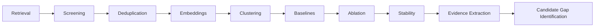

# An Agentic AI Framework for Automated Literature Analysis
## Potential Research-Gap Identification in Healthcare XAI

## Overview

This repository contains a small, reproducible research prototype for literature analysis in healthcare Explainable AI (XAI). It retrieves and screens a scholarly corpus, represents papers semantically, evaluates thematic clustering, performs controlled comparison studies, and extracts evidence-supported potential research-gap hypotheses.

The reusable implementation lives in `src/agentic_xai/`; command-line entry points live in `scripts/`. Existing artifact paths under `outputs/` are preserved for experimental provenance.

This is a research-assistance framework, not an autonomous system that definitively discovers, proves, or confirms research gaps. Candidate gaps require further investigation and domain review.

## Research Objective

The project studies whether a lightweight sequential agentic workflow can support transparent literature analysis and potential research-gap identification in healthcare XAI:



## Pipeline

1. `scripts/run_retrieval.py` retrieves from Semantic Scholar and arXiv, screens transparently, deduplicates records, and writes the corpus.
2. `scripts/run_analysis.py` creates normalized `all-MiniLM-L6-v2` embeddings and evaluates K-Means for K=2..8.
3. `scripts/run_evaluation.py` compares MiniLM with TF-IDF and TF-IDF plus Truncated SVD baselines.
4. `scripts/run_ablation.py` compares title-only, abstract-only, and title-plus-abstract representations.
5. `scripts/run_stability.py` evaluates K-Means initialization sensitivity across eight seeds using ARI/NMI for K=2 assignments.
6. `scripts/run_gap_analysis.py` extracts exact evidence-bearing abstract sentences and produces candidate gap hypotheses without an LLM or external API.

## Project Structure

```text
agentic-ai-xai-research/
├── README.md
├── requirements.txt
├── .gitignore
├── LICENSE
├── pyproject.toml
├── .env.example
├── src/
│   └── agentic_xai/
│       ├── config.py
│       ├── embeddings.py
│       ├── retrieval.py
│       ├── clustering.py
│       ├── evaluation.py
│       ├── ablation.py
│       ├── stability.py
│       └── gap_analysis.py
├── scripts/
│   ├── run_retrieval.py
│   ├── run_analysis.py
│   ├── run_evaluation.py
│   ├── run_ablation.py
│   ├── run_stability.py
│   └── run_gap_analysis.py
├── tests/
│   ├── test_imports.py
│   ├── test_paths.py
│   └── test_data_integrity.py
├── data/
│   ├── corpus.csv
│   └── README.md
├── outputs/
│   ├── figures/
│   └── README.md
└── docs/
    └── methodology.md
```

The current reusable package is `src/agentic_xai/`, and its six command-line wrappers are in `scripts/`. The compact tree above is retained only as a high-level view; see the package and wrapper directories for the complete current layout. Existing output paths remain unchanged for reproducibility.

## Installation

From the repository root:

```powershell
python -m venv .venv
.venv\Scripts\activate
python -m pip install -r requirements.txt
```

## API Key Configuration

Only retrieval requires credentials. Do not place keys in source files, notebooks, README files, or committed configuration.

PowerShell:

```powershell
$env:SEMANTIC_SCHOLAR_API_KEY="YOUR_API_KEY"
$env:ARXIV_CONTACT_EMAIL="your-email@example.com"
```

`src/agentic_xai/retrieval.py` reads `SEMANTIC_SCHOLAR_API_KEY` and `ARXIV_CONTACT_EMAIL` from the environment. The other stages are local and do not call external APIs.

## Running the Pipeline

Run stages from the repository root:

```powershell
python scripts/run_retrieval.py
python scripts/run_analysis.py
python scripts/run_evaluation.py
python scripts/run_ablation.py
python scripts/run_stability.py
python scripts/run_gap_analysis.py
```

All stages refuse to overwrite existing results unless explicitly invoked with `--overwrite` where supported. Do not rerun completed stages casually because generated files are experimental artifacts.

## Experimental Evaluation

The primary semantic representation uses `sentence-transformers/all-MiniLM-L6-v2`, 384-dimensional L2-normalized embeddings, title plus abstract text, K-Means with `random_state=42` and `n_init=20`, and K=2..8.

Baselines use TF-IDF plus K-Means and TF-IDF plus Truncated SVD plus K-Means. The ablation compares title-only, abstract-only, and title-plus-abstract MiniLM embeddings. Stability evaluates seeds `42, 0, 1, 2, 10, 20, 50, 100` and compares K=2 assignments using ARI and NMI.

## Results Summary

These values are preserved from the completed experiments:

- Final corpus: 187 unique papers
- Papers with usable abstracts: 175
- Best MiniLM silhouette: 0.06542618572711945 at K=2
- Best TF-IDF silhouette: 0.007523395743017814
- Best TF-IDF plus SVD silhouette: 0.01259804986750632
- Best title-only silhouette: 0.07902462780475616
- Best abstract-only silhouette: 0.061625465750694275
- Best title-plus-abstract silhouette: 0.06542618572711945
- K=2 selected in 7/8 stability seeds
- Mean pairwise K=2 ARI: 0.918258085681945
- Gap analysis: 96 evidence passages across 64 papers

All absolute silhouette scores were low. MiniLM performed better than the tested lexical baselines on best silhouette, while the title-only ablation was higher than title-plus-abstract in that experiment. Stability describes robustness to K-Means initialization, not semantic validity. Candidate gaps are evidence-supported hypotheses, not definitive discoveries.

## Output Files

See [outputs/README.md](outputs/README.md) for the output inventory and interpretation guidance. Outputs are experimental artifacts; clustering scores are descriptive evaluation results, and gap candidates are not proven gaps.

## Limitations

- Retrieval and relevance screening depend on API metadata and deterministic keyword rules.
- Abstract-only eligibility excludes papers without usable abstracts from embedding-based analysis, while retaining them in corpus accounting.
- Clustering quality is weak by silhouette score and does not establish semantic validity.
- Stability does not prove that the semantic grouping is substantively correct.
- Gap analysis uses deterministic evidence extraction from titles/abstracts and does not replace systematic review or expert judgment.
- Corpus redistribution may be subject to source-specific licensing and terms.
- No human expert validation was performed. F1-score and ROC-AUC are not applicable because this project has no labelled classification ground truth.

## Reproducibility

Paths are resolved relative to the repository root, so scripts can be invoked from another working directory. Seeds, K values, model settings, normalization, baseline configuration, ablation conditions, and stability settings are recorded in source and output metadata. Existing outputs are preserved and scripts avoid overwriting them unless explicitly requested where supported. Run lightweight, read-only integrity checks with `python -m unittest discover -s tests -v`.

## Citation

If you use this repository in academic work, cite the associated paper:

> An Agentic AI Framework for Automated Literature Analysis and Potential Research-Gap Identification: A Case Study in Healthcare XAI.

Add the final publication venue, authors, DOI, and version information when available.

## License

The code in this repository is released under the MIT License. See [LICENSE](LICENSE). Corpus redistribution may be subject to separate source-specific terms; inspect those requirements before publishing or redistributing `data/corpus.csv`.
